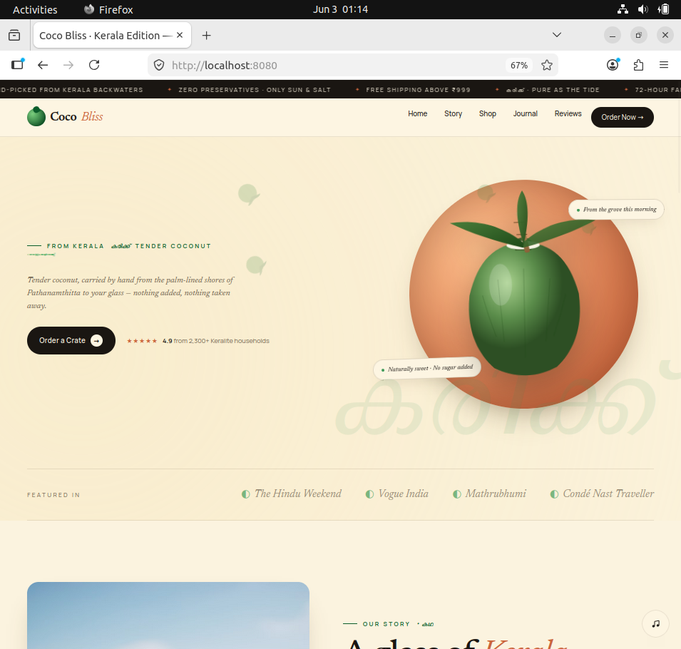
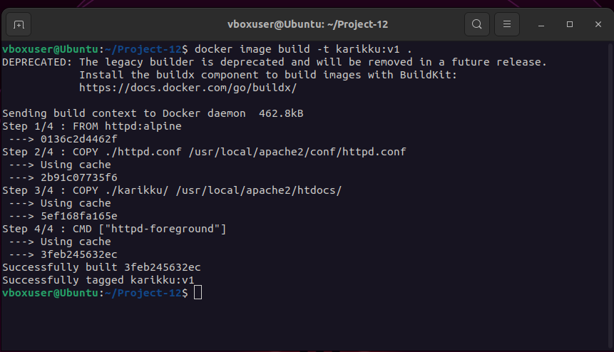
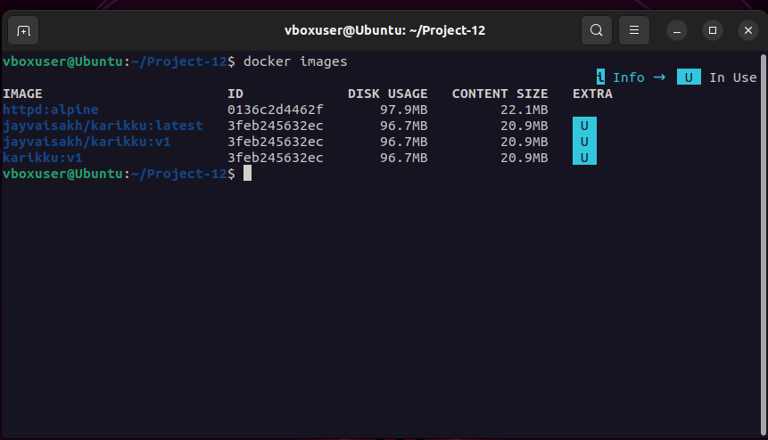
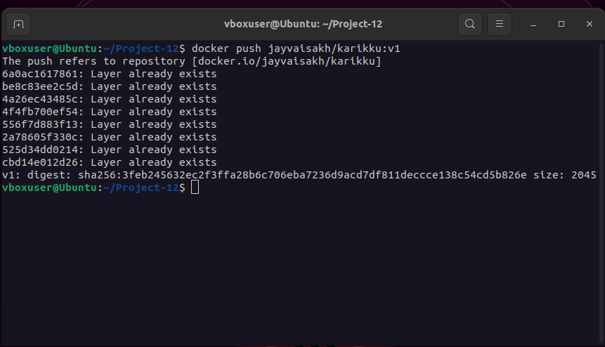

# 🐳 Dockerizing the Karikku Static Website using Apache HTTPD

Containerizing the Karikku static website using Docker and Apache (`httpd:alpine`), pushing the image to Docker Hub, and running it locally as a production-ready container.

---

# 📌 Project Overview

This project demonstrates how to take a plain HTML website, containerize it using Docker with an Apache web server, and host it locally using a real-world DevOps workflow.

| Detail     | Info                      |
| ---------- | ------------------------- |
| Base Image | `httpd:alpine`            |
| Web Server | Apache HTTP Server        |
| Website    | Karikku Static Website    |
| Docker Hub | `jayvaisakh/karikku:v1`   |
| Platform   | Ubuntu Linux (VirtualBox) |

---

# 🛠️ Tech Stack

<p align="left">
  
  
  
  
</p>

---

# 🌐 Website Running in Container

> Karikku static website served through Apache HTTP Server inside a Docker container on `localhost:8080`



---

# 🏗️ Architecture

```text
Local Machine
│
├── Project-12/
│   ├── karikku/
│   │   └── index.html
│   ├── httpd.conf
│   ├── Dockerfile
│   ├── screenshots/
│   └── README.md
│
▼
Docker Build
│
▼
Docker Image → karikku:v1
│
▼
Docker Hub → jayvaisakh/karikku:v1
│
▼
Docker Container → Port 8080 → Browser
```

---

# 📁 Project Structure

```text
Project-12/
├── karikku/
│   └── index.html
├── screenshots/
│   ├── docker-build.png
│   ├── docker-images.png
│   ├── docker-push.png
│   ├── docker-ps.png
│   └── website-output.png
├── httpd.conf
├── Dockerfile
└── README.md
```

---

# 🐳 Dockerfile

```Dockerfile
FROM httpd:alpine

COPY ./httpd.conf /usr/local/apache2/conf/httpd.conf

COPY ./karikku/ /usr/local/apache2/htdocs/

CMD ["httpd-foreground"]
```

---

# 🚀 Workflow

## 1. Prepare Website Files

```bash
mkdir karikku

cp index.html karikku/
```

---

## 2. Run Temporary Apache Container

```bash
docker container run --name web1 --rm -d httpd:alpine
```

---

## 3. Copy Apache Configuration File

```bash
docker cp web1:/usr/local/apache2/conf/httpd.conf .
```

---

## 4. Stop Temporary Container

```bash
docker container stop web1
```

---

## 5. Create Dockerfile

```bash
touch Dockerfile

nano Dockerfile
```

Add the following configuration:

```Dockerfile
FROM httpd:alpine

COPY ./httpd.conf /usr/local/apache2/conf/httpd.conf

COPY ./karikku/ /usr/local/apache2/htdocs/

CMD ["httpd-foreground"]
```

---

## 6. Build Docker Image

```bash
docker image build -t karikku:v1 .
```



---

## 7. Verify Docker Images

```bash
docker images
```



---

## 8. Login to Docker Hub

```bash
docker login
```

Authenticate using browser-based login.

---

## 9. Tag Docker Image

```bash
docker image tag karikku:v1 jayvaisakh/karikku:v1
```

---

## 10. Push Image to Docker Hub

```bash
docker push jayvaisakh/karikku:v1
```



---

## 11. Run Docker Container

```bash
docker run -d --name karikku -p 8080:80 jayvaisakh/karikku:v1
```

---

## 12. Verify Running Container

```bash
docker ps
```


---

## 13. Access Website

Open browser:

```text
http://localhost:8080
```

If using VirtualBox VM:

```bash
ip a
```

Then open:

```text
http://YOUR-IP:8080
```

---

## 14. Verify using Curl

```bash
curl -I http://localhost:8080
```

Expected Output:

```text
HTTP/1.1 200 OK
```

---

# 🐋 Docker Hub

Pull image:

```bash
docker pull jayvaisakh/karikku:v1
```

Run image:

```bash
docker run -d -p 8080:80 jayvaisakh/karikku:v1
```

---

# 🔧 Troubleshooting

## Wrong Image Name

Wrong:

```bash
docker container run -- name web1 --rm -d httpd:alphine
```

Correct:

```bash
docker container run --name web1 --rm -d httpd:alpine
```

---

## Missing Build Context

Wrong:

```bash
docker image build -t karikku:v1
```

Correct:

```bash
docker image build -t karikku:v1 .
```

---

# ✅ Outcome

* Dockerized the Karikku static website
* Configured Apache HTTP Server inside Docker
* Built a custom Docker image
* Pushed image to Docker Hub
* Hosted website locally on port `8080`

---

# 👤 Author

**Vaisakh J**
Cloud & DevOps Learner
<p align="left">
  <a href="https://github.com/jayvaisakh">
    
  </a>

  <a href="https://www.linkedin.com">
    
  </a>

  <a href="https://medium.com">
    
  </a>
</p>
